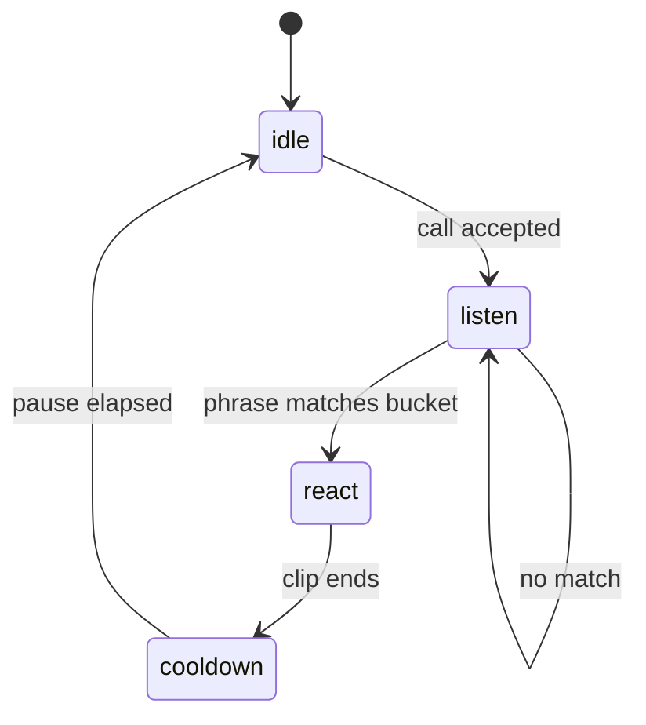

# Clip Library Architecture Plan

This document describes the **dog-facetime-clips** product direction: FaceTime-style memorial calls driven by **prerendered idle and reaction clips**, triggered by spoken phrases. It complements the still-image Ken Burns app in [thorpemark/dog-facetime](https://github.com/thorpemark/dog-facetime).

## Goals (v1)

1. Same call UX as the still app: incoming ring, active call, portrait/landscape framing, share links.
2. **Idle:** loop one or more calm clips (or crossfade stills until clips exist).
3. **Listen:** Web Speech API (web) / Speech framework (iOS) transcribes speech continuously.
4. **React:** map transcript → **reaction bucket** → pick **one clip at random** from that bucket → crossfade playback → return to idle.
5. **Not** live generative video in the call — only seamless playback of prerendered MP4s.

Murphy / Riley are the first dogs; buckets and phrases should feel natural for how Mark talks to them.

---

## High-level flow



```
Transcript ──► normalize ──► match buckets (priority) ──► bucket id
                                                      │
                                                      ▼
                                            pickRandomClip(bucket)
                                                      │
                                                      ▼
                                            crossfade to MP4
```

---

## Reaction taxonomy

Each **bucket** is a semantic category with many synonymous **phrases** and several **clip variants**.

| Bucket id | Example phrases | Clip mood (Murphy/Riley) |
|-----------|-----------------|--------------------------|
| `name` | `{dogName}`, "Murphy", "Riley" | Perk up, eye contact |
| `come` | "come here", "c'mere", "here boy" | Head tilt, step forward |
| `good` | "good dog", "good boy", "who's a good" | Happy wag, soft eyes |
| `treat` | "treat", "chicken", "want a cookie", "snack" | Excited, mouth open |
| `walk` | "walk", "go for a walk", "outside" | Alert, tail energy |
| `no` | "no", "no no", "stop that" | Ears back, pause |
| `owner` | `{ownerName}`, "Mark" | Recognition, lean in |
| `here` | "here", "over here", "this way" | Look toward camera |
| `play` | "play", "ball", "fetch" | Bouncy (future) |
| `quiet` | "quiet", "shh", "settle" | Calm down (future) |

Buckets are extensible. **`{dogName}`** and **`{ownerName}`** placeholders expand at runtime from memorial profile data.

**Priority:** when multiple buckets match the same transcript substring, higher `priority` wins (same as today’s `keyword_rules.json`).

---

## Phrase → bucket matching

### v1 (shipped pattern)

- Lowercase transcript.
- For each bucket (sorted by priority), check if any resolved phrase is a **substring** of the transcript.
- First match wins.

Implementation today: `web/src/utils/keywordRules.ts` + `web/public/keyword_rules.json`.

### v1.1 (clips fork)

- Source phrases from `web/src/data/reactionCatalog.ts` (single source of truth).
- Keep `keyword_rules.json` for backward compatibility until playback is fully wired to the catalog.

### v2 (closest match)

When no substring match:

1. Tokenize transcript (remove filler words).
2. Score each bucket by best phrase similarity (Levenshtein / trigram / embedding — TBD).
3. Fire only if score ≥ threshold; optional debug overlay shows near-misses.

Cooldown (~2s) prevents double-firing on partial transcripts.

---

## Randomness within a bucket

Each bucket holds **N ≥ 1** clip paths. On match:

```ts
const clipPath = pickRandomClipForBucket(bucketId, { excludeLast: true })
```

- Uniform random among variants.
- Optional **exclude last played** in the same bucket to reduce back-to-back repeats.
- Seed not required; variety is the goal.

Wire point: `useKeywordSpotter` → `onMatch(bucketId)` → `useMediaPlayback.playReaction(bucketId)` → resolve clip URL → dual-video crossfade (already implemented for single `clipFileName` per rule).

**TODO:** extend `playVideoReaction` to call `pickRandomClipForBucket` instead of `rule.clipFileName`.

---

## Clip asset layout

### Static (dev / demo / GitHub Pages)

```
web/public/clips/
  idle/
    idle_01.mp4          # primary loop
    idle_02.mp4          # optional alternates
  reactions/
    come/
      come_01.mp4
      come_02.mp4
      come_03.mp4
    treat/
      treat_01.mp4
      ...
    good/
    walk/
    no/
    name/
    owner/
```

Portrait **720×1280** (9:16) preferred for phone FaceTime simulation. Reuse focal framing concepts from the still app for any letterboxing overlays.

### Supabase Storage (per-memorial, production)

| Object path | Purpose |
|-------------|---------|
| `memorials/{memorialId}/clips/idle/{file}` | Memorial-specific idle loops |
| `memorials/{memorialId}/clips/reactions/{bucket}/{file}` | Reaction variants |
| `memorials/{memorialId}/catalog.json` | Bucket phrase overrides, clip manifest |

**Static vs Supabase:**

| Concern | Static (`public/clips`) | Supabase bucket |
|---------|-------------------------|-----------------|
| Setup | Commit MP4s or CI artifact | Upload via admin script |
| Sharing | One global Murphy/Riley set | Per-memorial clip sets |
| Bandwidth | GitHub Pages CDN | Supabase CDN + RLS |
| v1 recommendation | **Start here** for Mark’s clip generation sprint | Add when memorial-specific clips ship |

RLS: public read for shared memorial clip paths keyed by `share_id`; write only for owner via service role or signed upload URLs.

---

## Playback modes (dual mode)

The web app currently chooses mode in `useMediaPlayback`:

| Condition | Mode | Behavior |
|-----------|------|----------|
| Memorial has uploaded photos | `photos` | Ken Burns + motion presets on keyword (still app) |
| No photos | `video` | MP4 idle + reaction clips |

**Clips fork target:** explicit memorial flag, e.g. `playbackMode: 'photos' | 'clips' | 'both'`.

- `'clips'`: always video library even if photos exist.
- `'both'`: idle = clip loop; reactions = video (photos as optional fallback).
- Default for new memorials in this repo: `'clips'` once assets exist.

Do **not** remove Ken Burns until dual mode is tested — mark TODOs in `useMediaPlayback.ts`.

---

## Generating clips later

Prerender with AI video tools; keep **consistent framing** (same virtual “camera distance”, portrait crop).

Suggested pipeline:

1. **Source:** best portrait stills or short phone video of Murphy/Riley from the still app uploads.
2. **Prompt template per bucket:** e.g. treat → "dog looks excited, mouth slightly open, subtle tail wag, portrait phone framing, natural lighting".
3. **Tools:** Runway Gen-3/Gen-4, Kling, Pika, or image-to-video on key stills.
4. **Post:** trim to 1–3s, H.264, loop-friendly idle segments, normalize loudness if adding audio (usually silent).
5. **Review:** reject clips with morphing artifacts; keep 3–5 variants per bucket.
6. **Import:** drop into `web/public/clips/reactions/{bucket}/` and register paths in `reactionCatalog.ts`.

Naming: `{bucket}_{nn}.mp4` (zero-padded index).

---

## Migration from still memorials

Existing memorials in Supabase store **photo URLs + focal points**, not clips.

| Step | Action |
|------|--------|
| 1 | Add optional `playback_mode` column (`photos` default for legacy rows). |
| 2 | For Murphy/Riley memorials Mark controls, set `playback_mode = 'clips'`. |
| 3 | Upload clip manifest to Storage or ship global catalog in repo. |
| 4 | UI: create flow asks "Photos, clips, or both?" — hide clip option until assets present. |
| 5 | Share links unchanged; viewer picks renderer from memorial metadata. |

Photos remain valid indefinitely in **dog-facetime**; this repo adds clip rendering without breaking shared schema.

---

## iOS parity

`MemorialCall/` already implements idle/react/cooldown with single `clipFileName` per rule. Mirror:

1. `ReactionCatalog.swift` generated or hand-synced from `reactionCatalog.ts`.
2. Random pick in `VideoMixer` / `CallViewModel` on rule match.
3. Bundle structure: `Resources/Clips/reactions/{bucket}/`.

---

## Implementation checklist

- [x] Fork repo + README product split
- [x] `reactionCatalog.ts` stub with phrases + placeholder paths
- [x] Comments in keyword spotter / keyword rules toward random bucket pick
- [ ] `playVideoReaction` uses `pickRandomClipForBucket`
- [ ] Load catalog instead of (or merged with) `keyword_rules.json`
- [ ] Multiple idle clips + rotation
- [ ] `playback_mode` on memorial schema
- [ ] Supabase clip upload + manifest
- [ ] Closest-match fallback scorer
- [ ] iOS catalog sync

---

## Open questions

1. **Global vs per-dog catalogs:** one Murphy set + one Riley set, or bucket clips tagged by dog and filtered by call target?
2. **Together calls:** split-screen two idle loops, or composite still?
3. **Audio:** silent clips vs subtle ambient paw/ collar sounds?
4. **Clip length cap:** hard max 3s for snappy FaceTime feel?

Decisions can land during Mark’s clip generation sprint without blocking the scaffold in this repo.
